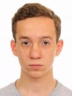

# Сергей Никитич Заречнев

Мужчина, 22 года, родился 19 октября 1999 г.

## Контакты:

1. [Мобильный](тел.:+7-958-634-0407) (`+7-958-634-0407`)
2. [Telegram](https://t.me/da_kurlzzzzz) (`da_kurlzzzzz`)
3. [Электронная почта](mailto:da_kurlzzzzz@mail.ru) (`da_kurlzzzzz@mail.ru`)

## Проживание

Московская область, Гражданство: Россия

## Желаемая должность и зарплата

* Младший разработчик
* ИТ, Интернет
* Разработка программного обеспечения
* DevOps-инженер
* Учитель информатики

### 80000 рублей в месяц

График работы ограничен в связи с обучением до июня 2023 г.

## Общий стаж - 1 год 4 месяца

### июль 2019 г. - август 2019 г. (2 месяца)

[ИОН цифровой центр](https://ноу-хау.рф/) Москва

* Розничная торговля
* Розничная сеть (электроника, бытовая техника)
* Менеджер-консультант
* Профессиональные консультации клиентов в области мобильной электроники,
  продажи.

### февраль 2019 г. - июнь 2019 г. (5 месяцев)

[Московский физико-технический институт (Государственный
университет)](https://mipt.ru) Московская область

* Образовательные учреждения
* Университет
* Лаборант-исследователь
* Организационная деятельность в лабораториях МФТИ
* Съемка, монтаж и публикация лекций и семинаров в МФТИ

### август 2017 г. - апрель 2018 г. (9 месяцев)

[ЗАО "КБ "Проминжиниринг"](https://www.tpstrogino.ru/residents/84) Москва

* Промышленное оборудование, машины, станки и комплектующие
* Оборудование и машины для горнодобывающей, энергетической, нефтегазовой и
  химической промышленности (монтаж, сервис, ремонт)
* Оборудование и машины для горнодобывающей, энергетической, нефтегазовой и
  химической отрасли (производство)
* Информационные технологии, системная интеграция, интернет
* Разработка программного обеспечения
* Компьютерщик
* Работа в команде программистов, занимающихся разработкой и поддержкой
  программное обеспечение для технических решений, производимых компанией.

### Февраль 2018 г. – настоящее время (неофициально)

[Ассоциация репетиторов](https://repetit.ru)

* Частное обучение
* Обучение детей в возрасте 12 - 18 лет
* Преподавание студентам вузов
* Информатика
* Математика
* Физика
* Экзамены в средней школе (ОГЭ, ЕГЭ)

## Образование

Неполный бакалавриат

* Московский физико-технический институт, Москва
* Институт нано-, био-, информационных, когнитивных и социогуманитарных наук
  и технологий
* Окончание в июне 2023 г.

## Обучение и курсы

### [Программирование на C++](https://www.specialist.ru) 2017

### [Школа компьютерщиков программистов](https://sf.misis.ru/abitur/pre-university-training/programmers-school) 2015

## Ключевые навыки

### Языки

* Русский - Родной
* Английский - B2 - Upper-intermediate
* Испанский - A1 - Начальный

### Дополнительные навыки

* Дистанционное обучение
* Частное обучение
* B2C продажи
* Математическое программирование
* Редактирование видео
* Редактирование звука
* Экстремальное программирование
* Асинхронное программирование
* Математическое моделирование
* Настройка ПК
* Android
* Android SDK
* С/С++
* Python
* Java
* SQL
* Linux (Arch Linux)
* Linux kernel
* Управление юнитами systemd
* Менеджеры пакетов
* Кроссплатформенная разработка
* SDL2/OpenGL

### Опыт вождения

Водительское удостоверение категории В

### Дополнительная информация

Общительный, способный быстро осваивать новые навыки. Опыт работы в команде по
разработке программного обеспечения. Опыт обучения студентов школ и вузов
языкам программирования (C, C++, Python, Java), а также информатике. Опыт
написания программ для физического моделирования и тест-кейсов к ним.

<!-- vim:set tw=78: -->
